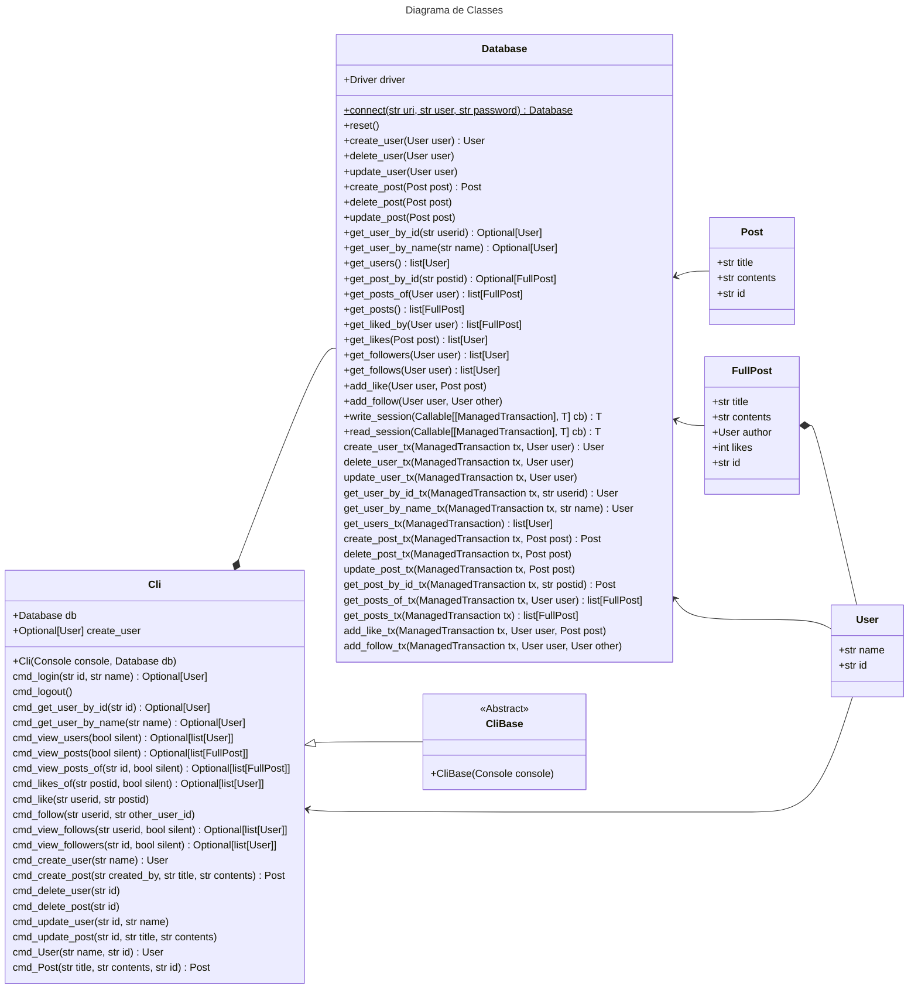

# Projeto Banco de Dados 2

Rede social na linha de comando usando o Neo4J.

Existem usuários, identificados por nome e id, e *posts* com título e conteúdo.
Usuários podem dar *likes* em *posts* e seguir outros usuários.

A linha de comando utiliza de argumentos no estilo UNIX, com algumas diferenças
quase que gritantes para funcionalidades mais avançadas.

## Uso

Para se executar o programa (`python3 main.py`) é preciso ter instalado:

- `neo4j` para comunicação com o banco
- `rich` para que o terminal fique bonito.

Ambos podem ser instalados com `pip` usando os nomes acima.

### Exemplo 1

O programa conta com um menu de ajuda extensivo. O nome de todos os comandos
podem ser passados para `help` para ter uma explicação mais detalhada.

```python
> help
Use `help Self` to get more general help about the CLI.
Available commands:
- Post(title: str, contents: str, id: None) -> __main__.Post
- User(name: str, id: str) -> __main__.User
- create_post(created_by: str, title: str, contents: str) -> __main__.Post
- create_user(name: str) -> __main__.User
- delete_post(id: str) -> None
- delete_user(id: str) -> None
- dumpenv() -> None
- echo(value: typing.Any) -> None
- exit() -> None
- follow(userid: str, other_user_id: str) -> None
- help(name: str | None) -> None
- idx(d: list, idxs: int) -> typing.Any | None
- inspect(name: str) -> None
- key(d: dict, keys: tuple) -> typing.Any | None
- like(userid: str, postid: str) -> None
- likes_of(postid: str, silent: bool) -> list[__main__.User] | None
- loadenv(name: None, overwrite: None) -> None
- login(id: str, name: str) -> typing.Optional[__main__.User]
- logout() -> None
- saveenv(name: None) -> None
- set(key: str, value: typing.Any) -> None
- test(value: typing.Any) -> bool
- update_post(id: str, title: str, contents: str) -> None
- update_user(id: str, name: str) -> None
- view_followers(id: str, silent: bool) -> list[__main__.User] | None
- view_follows(id: str, silent: bool) -> list[__main__.User] | None
- view_posts(silent: bool) -> list[__main__.FullPost] | None
- view_posts_of(id: str, silent: bool) -> list[__main__.FullPost] | None
- view_users(silent: bool) -> list[__main__.User] | None
< None
> help follow
Help on method cmd_follow in module __main__:

cmd_follow(userid: str, other_user_id: str) -> None method of __main__.Cli instance
    Siga outro usuário.
    - Se `id` for 'me' ou um string vazio, vai ser usar o usuário logado no momento.

< None
```

### Exemplo 2

Para se criar um usuário, logar como esse novo usuário e criar um post:

```python
> create_user foo
< User(name='foo', id='4:af0946ba-f1c6-4c54-9f83-9cc521d1fd9a:8')
> create_post '4:af0946ba-f1c6-4c54-9f83-9cc521d1fd9a:8' "FOO" "FOOOOOOOOOO"
< Post(title='FOO', contents='FOOOOOOOOOO', id='4:af0946ba-f1c6-4c54-9f83-9cc521d1fd9a:9')
> view_posts
┏━━━━━━━━━━━━━━━━━━━━━━━━━━━━━━━━━━━━━━━━━━━┳━━━━━━━━━━━┳━━━━━━━┳━━━━━━━━━━━━━━━━━━━━━━━┳━━━━━━━━━━━━━━━━━━━━━━━━━━━━━━━━━━━━━━━━━━━━━━━━━━━━━━━━━━━━━━━━━━━━━━━━━━━━━━━━━━━━━━━┓
┃ id                                        ┃ author    ┃ likes ┃ title                 ┃ contents                                                                              ┃
┡━━━━━━━━━━━━━━━━━━━━━━━━━━━━━━━━━━━━━━━━━━━╇━━━━━━━━━━━╇━━━━━━━╇━━━━━━━━━━━━━━━━━━━━━━━╇━━━━━━━━━━━━━━━━━━━━━━━━━━━━━━━━━━━━━━━━━━━━━━━━━━━━━━━━━━━━━━━━━━━━━━━━━━━━━━━━━━━━━━━┩
│ 4:af0946ba-f1c6-4c54-9f83-9cc521d1fd9a:5  │ John      │ 2     │ Rust!                 │ Once uppon a time, a fungus plague infested the land. The Crabs! They were the cause! │
│ 4:af0946ba-f1c6-4c54-9f83-9cc521d1fd9a:9  │ foo       │ 0     │ FOO                   │ FOOOOOOOOOO                                                                           │
│ 4:af0946ba-f1c6-4c54-9f83-9cc521d1fd9a:11 │ `deleted` │ 1     │ Things have been done │ i just don't know what                                                                │
│ 4:af0946ba-f1c6-4c54-9f83-9cc521d1fd9a:16 │ Bob       │ 3     │ Genius                │ Tom is a genius                                                                       │
│ 4:af0946ba-f1c6-4c54-9f83-9cc521d1fd9a:18 │ Bob       │ 1     │ C++                   │ C++ is hard                                                                           │
└───────────────────────────────────────────┴───────────┴───────┴───────────────────────┴───────────────────────────────────────────────────────────────────────────────────────┘
< None
```

De forma mais exótica, é possível usar do sistema de variáveis disponível:

```python
# - coleta o usuário de nome 'foo'
# - extrai o campo 'id' do objeto (o valor do último comando fica em '_')
# - salva em uma variável chamada 'foo'
> get_user_by_name foo | field _ id | set foo
< '4:af0946ba-f1c6-4c54-9f83-9cc521d1fd9a:8'
# utiliza a variável 'foo' criada
> create_post $foo 'fooo?' 'THE FOO!'
< Post(title='fooo?', contents='THE FOO!', id='4:af0946ba-f1c6-4c54-9f83-9cc521d1fd9a:17')
```

### Exemplo 3

É possível ainda ver os posts de um usuário, seus seguidores e seguidos.

```py
> get_user_by_name Tom | field _ id | set tom
< '4:af0946ba-f1c6-4c54-9f83-9cc521d1fd9a:3'
> view_posts_of $tom
┏━━━━━━━━━━━━━━━━━━━━━━━━━━━━━━━━━━━━━━━━━━━┳━━━━━━━━┳━━━━━━━┳━━━━━━━━┳━━━━━━━━━━━━━━━━━━━━━━━━━━━━━━━━━━━━━━━━━━━━━━━━━━━━━━━━━━━━━━━━━━━━━━━━━━━━━━━━━━━━━━━┓
┃ id                                        ┃ author ┃ likes ┃ title  ┃ contents                                                                              ┃
┡━━━━━━━━━━━━━━━━━━━━━━━━━━━━━━━━━━━━━━━━━━━╇━━━━━━━━╇━━━━━━━╇━━━━━━━━╇━━━━━━━━━━━━━━━━━━━━━━━━━━━━━━━━━━━━━━━━━━━━━━━━━━━━━━━━━━━━━━━━━━━━━━━━━━━━━━━━━━━━━━━┩
│ 4:af0946ba-f1c6-4c54-9f83-9cc521d1fd9a:5  │ John   │ 0     │ Rust!  │ Once uppon a time, a fungus plague infested the land. The Crabs! They were the cause! │
│ 4:af0946ba-f1c6-4c54-9f83-9cc521d1fd9a:9  │ foo    │ 0     │ FOO    │ FOOOOOOOOOO                                                                           │
│ 4:af0946ba-f1c6-4c54-9f83-9cc521d1fd9a:16 │ Bob    │ 0     │ Genius │ Tom is a genius                                                                       │
│ 4:af0946ba-f1c6-4c54-9f83-9cc521d1fd9a:17 │ foo    │ 0     │ fooo?  │ THE FOO!                                                                              │
│ 4:af0946ba-f1c6-4c54-9f83-9cc521d1fd9a:18 │ Bob    │ 0     │ C++    │ C++ is hard                                                                           │
└───────────────────────────────────────────┴────────┴───────┴────────┴───────────────────────────────────────────────────────────────────────────────────────┘
< None
> view_followers $tom
┏━━━━━━━━━━━━━━━━━━━━━━━━━━━━━━━━━━━━━━━━━━┳━━━━━━┓
┃ id                                       ┃ name ┃
┡━━━━━━━━━━━━━━━━━━━━━━━━━━━━━━━━━━━━━━━━━━╇━━━━━━┩
│ 4:af0946ba-f1c6-4c54-9f83-9cc521d1fd9a:2 │ Bob  │
└──────────────────────────────────────────┴──────┘
< None
> view_follows $tom
┏━━━━┳━━━━━━┓
┃ id ┃ name ┃
┡━━━━╇━━━━━━┩
└────┴──────┘
< None
```

## Diagrama de classes

Por causa das interações entre as classes e visando a praticidade do sistema,
todos os métodos que abstraem o *Cypher* foram colocados na classes *Database*.
DAO (*Data Access Objects*) foram testados e não se mostraram positivos.


